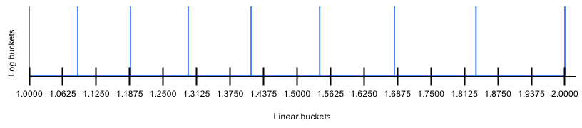

# Bucket Indexer

## Class Hierarchy

The indexers are in its own [Indexer Java package](src/main/java/com/newrelic/nrsketch/indexer). The package is
self-contained. It can be used without the rest of NrSketch. The class hierarchy in the package is:

    BucketIndexer // Interface
        |--- ScaledExpIndexer // Abstract class
                 |--- LogIndexer
                 |--- ExponentIndexer
                 |--- SubBucketIndexer // Abstract class
                          |--- SubBucketLogIndexer
                          |--- SubBucketLookupIndexer

The **BucketIndexer** interface is the root of the hierarchy. It defines the API of an indexer, which is very simple,
basically, mapping a "double" value to a bucket index, and mapping a bucket index to the bucket's start and end bound.

**ScaledExpIndexer** is the abstract base class for scaled exponential indexers, which have the following properties:

* bucket_lower_bound = base ^ bucket_index
* base = 2 ^ (2 ^ -scale)

**SubBucketIndexer** is the abstract base class for all subBucket indexers, which divide the mantissa into log scale
subbuckets for each binary exponent in "double". It works only on scales greater than 0.

The followings are concrete classes you can actually instantiate:

* **LogIndexer**: Calls Math.log() for mapping. This is the canonical indexer derived directly from the mathematically
  definition of the scaled base2 indexer.
    * It is relatively slow, because of the log() function
    * It is less accurate than SubBucketLogIndexer because the log() function has to handle the full "double" range.
      Computational error grows with scale and the absolute value of input's exponent (less accurate on larger numbers
      and numbers closer to 0).
* **ExponentIndexer**: Computes index from the exponent part of "double" representation.
    * It is very fast because it uses simple integer operations only.
    * It has no computational error at all because it uses integer operations only.
    * It can only be used on 0 and negative scales, where base >= 2.
* **SubBucketLogIndexer**: Does subbucketing using the Math.log() function.
    * It is more accurate than plain LogIndexer because it limits log() calls to values from 1 to 2. Computational error
      is not sensitive to scale or exponent of input values. It can go all the way to scale 52.
    * Performance is slightly faster than LogIndexer.
* **SubBucketLookupIndexer**: Does subbucketing using lookup tables. Log scale boundaries from 1 to 2 are precomputed.
    * It is very fast because mapping uses integer operations only.
    * But it costs more space due to the lookup tables, which costs about 16 * 2^scale bytes. For example, scale 20
      costs 16MB. Though it is not practical on higher scales, it is practical for most telemetry use cases, where the
      scale is around 6 and memory cost is a few kilo bytes.

As shown above, no indexer excels in all aspects. The **IndexerOption** enum class provides an AUTO_SELECT option to
select the best indexer based on scale. It is the default option for NrSketch. The selection criteria is:

* Scale > 6: SubBucketLogIndexer. Slower, but uses no extra memory.
* Scale in (0, 6]: SubBucketLookupIndexer. Fast mapping at the memory cost of 1KB or less.
* Scale <= 0: ExponentIndexer. Fastest mapping, no extra memory.

At the default initial scale of 12, AUTO_SELECT starts with SubBucketLogIndexer. At the default 320 buckets, most
datasets will quickly downscale to scale 6 (when contrast exceeds 5.66) and start using the more efficient
SubBucketLookupIndexer.

Note that the LogIndexer class is not used by AUTO_SELECT at all. It was written mostly as a reference to test other
indexers.

### Special features

* The indexers return a 64 bit "long" index. All double values can be mapped to an index, at all meaningful scales
  (-11 to 52, inclusive).
* All indexers handle subnormal numbers properly, conforming to the bound and base formula.

## How the lookup indexer works

The "double" [IEEE representation](https://en.wikipedia.org/wiki/Double-precision_floating-point_format)
is in binary floating point format of mantissa * 2^exponent. The "exponent" field is effectively scale 0 (base=2)
bucketing. The mantissa is always in the range of [1, 2). We only need to divide the mantissa range into log scale
subbuckets to get to higher scales.

The diagram below shows dividing the mantissa range into 8 log subbuckets, shown with blue lines. At the same time, the
range is also divided into 16 linear subbuckets, shown as black ticks along the x axis.



With 2 times more linear subbuckets than log scale subbuckets, linear subbuckets are narrower. A linear subbucket is
either completely enclosed in a log subbucket, or spans 2 log subbuckets. The linear to log bucket ratio is proven later
in this doc in the [Linear to log bucket ratio](#linear-to-log-bucket-ratio) section.

Two lookup tables are used. The first one, logBucketIndexArray is indexed by linear subbucket index. The array content
is the log bucket index where start of the linear bucket falls into. The 2nd one, logBucketEndArray is indexed by log
subbucket index. The content is the end bound of the log bucket. Below is code from SubBucketLookupIndexer to map a
mantissa to a log subbucket:

```
long getSubBucketIndex(final long mantissa) {
    final int linearArrayIndex = (int) (mantissa >>> mantissaShift);
    final int logBucketIndex = logBucketIndexArray[linearArrayIndex];
    return mantissa >= logBucketEndArray[logBucketIndex] ? logBucketIndex + 1 : logBucketIndex;
}
```

The code first shifts the mantissa to get linear array index. Then looks up in logBucketIndexArray to get
logBucketIndex. If the linear bucket spans two log buckets, we need to determine which log bucket the value falls into.
This is simply done by comparing the value against the end bound of the log bucket. If the linear bucket is completely
enclosed in one log bucket, then the value will be smaller than the log bucket end and the function will return
logBucketIndex as is.

The final log bucket index can be quickly computed from the log subbucket index and exponent from "double". During value
to index mapping, only simple integer operations are used. It is much faster than calling Math.log(). Below are some
indexer benchmark numbers (indexer is coupled with SimpleNrSketch):

| Index option            | insert speed (ns/insert) |
| ----------------------- | ------------------------ |
| LogIndexer              | 32 |
| SubBucketLogIndexer     | 29 |
| SubBucketLookupIndexer  | 19 |
| AUTO_SELECT             | 19 | 

As shown above, LogIndexer is significantly slower. SubBucketLogIndexer is slightly faster than LogIndexer.
SubBucketLogIndexer is used in AUTO_SELECT on larger scales because of this, and also because it is more consistent with
SubBucketLookupIndexer. AUTO_SELECT showed no difference from SubBucketLookupIndexer in this dataset (random numbers
from 1 to 1M). This is expected because the dataset downscales into SubBucketLookupIndexer quickly.

The memory cost of the lookup indexer is small at the scales of interest to telemetry. AUTO_SELECT limits lookup indexer
to scale 6, where the array sizes are 128 * 4 and 64 * 8, for a total of 1024 bytes. The logBucketIndexArray is now "
int[ ]". For lower scales, we could optimize it to "byte[ ]", or "short[ ]" to save space. And the code can also use
static arrays computed on program start or defined at compile time.

If we publish the logBucketEndArray content for commonly used scales, all implementations using the published array will
produce consistent result on any platform. In contrast, calling Math.log() may produce different results on boundary
values due to differences in floating point processing and log() function implementation.

### Linear to log bucket ratio

With 2 times more linear subbuckets than log scale subbuckets, a linear subbucket is always narrower than any log scale
subbucket. Below is an informal proof:

Because log bucket width increases monotonically, we only need to prove that linear bucket width is smaller than the 1st
log bucket width.

Let N be the number of log scale buckets. We have  
N log buckets: base ^ N = 2, first bucket ends at base  
2N linear buckets: bucketWidth = 1/2N, First linear bucket ends at 1 + 1/2N

If we can prove that (1 + 1/2N) ^ N < 2, then we have proven that 1 + 1/2N < base (linear bucket width is smaller than
log scale bucket width).

To prove (1 + 1/2N) ^ N < 2  
we apply square on both sides of "<": (1 + 1/2N) ^ 2N < 4

(1 + 1/2N) ^ 2N matches the definition of [Euler' number e](https://en.wikipedia.org/wiki/E_(mathematical_constant)),
which is defined as (1 + 1/n)^n when n approaches infinity. The (1 + 1/n)^n sequence represents
the [compound interest sequence](https://en.wikipedia.org/wiki/E_(mathematical_constant)#Compound_interest), which grows
toward e as n grows:

| n        | (1 + 1/n)^n |
| -------- | ----------- |
| 1        | 2.0000      |
| 2        | 2.2500      |
| 3        | 2.3704      |
| 4        | 2.4414      |
| 10       | 2.5937      |
| 100      | 2.7048      |
| 1000     | 2.7169      |
| infinity | 2.7182 ...  |

As shown above, the sequence is always below 4. Thus we have proven that linear bucket width is smaller than log bucket
width. 