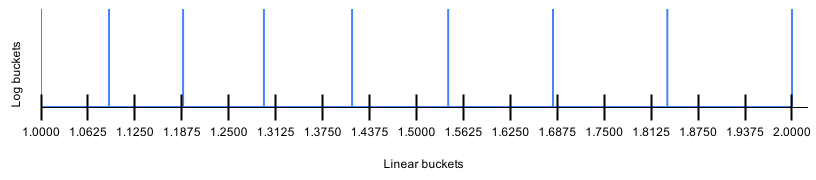

[](https://opensource.newrelic.com/oss-category/#new-relic-experimental)

# New Relic Sketch

## Introduction

New Relic Sketch (aka NrSketch)  is a scaled base2 exponential histogram. It is adapted from the histogram code used at 
New Relic. It is a
prototype for Open Telemetry Enhancement Proposal
149 [Add exponential bucketing to histogram protobuf](https://github.com/open-telemetry/oteps/blob/main/text/0149-exponential-histogram.md)
. It is also an option in the Open Telemetry
discussion [Referendum on Histogram format](https://github.com/open-telemetry/opentelemetry-specification/issues/1776).
As a prototype, it is meant to demonstrate ideas. It has not been thoroughly tested, and some functionality may be
missing. For example, serialization and deserialization, uploading the library to an artifactory repository have not
been implemented. Work to "productize" the prototype is in progress.

A scaled base2 exponential histogram has these properties:

* bucket_lower_bound = base ^ bucket_index
* base = 2 ^ (2 ^ -scale)

Bucket index is an integer that can be positive (bound > 1), 0 (bound = 1), or negative (bound < 1). Base is a floating
point number greater than 1. It is further restricted by scale. Scale is an integer that can be positive (base < 2), 0 (
base = 2), or negative (base > 2). The following table shows bases at selected scales.

| scale | base      | relative error | dataset contrast at 320 buckets |
| ----- | --------- | -------------- | --------------------------- |
| 12    | 1.000169  | 0.008461%      | 1.06                        |
| 11    | 1.000339  | 0.016923%      | 1.11                        |
| 10    | 1.000677  | 0.033845%      | 1.24                        |
| 9     | 1.001355  | 0.067690%      | 1.54                        |
| 8     | 1.002711  | 0.135380%      | 2.38                        |
| 7     | 1.005430  | 0.270760%      | 5.66                        |
| 6     | 1.010889  | 0.541516%      | 32                          |
| 5     | 1.021897  | 1.083000%      | 1,024      (1K)             |
| 4     | 1.044274  | 2.165746%      | 1,048,576  (1M)             |
| 3     | 1.090508  | 4.329462%      | 1.10E+12   (1T)             |
| 2     | 1.189207  | 8.642723%      | 1.21E+24                    |
| 1     | 1.414214  | 17.157288%     | 1.46E+48                    |
| 0     | 2.000000  | 33.333333%     | 2.14E+96                    |
| \-1   | 4.000000  | 60.000000%     | 4.56E+192                   |
| \-2   | 16.000000 | 88.235294%     | 2.08E+385                   |

"Relative error" here is the relative error of percentile or quantile calculated from the histogram. Relative error is
defined as "Math.abs(reportedValue - actualValue) / reportedValue". To minimize error, percentile calculation returns
the middle point of a bucket when a requested percentage falls within a bucket. Thus  
error = (bucketWidth/2) / bucketMidPoint = ((base - 1) / 2) / ((base + 1) / 2) = (base - 1) / (base + 1).

The scales of interest to most telemetry applications is around 3, 4, and 5, where relative error is around a few
percent. As a series, the bases can be defined as:  
```base[0] = 2```  
```base[scale - 1] = square(base[scale])```  
This property of the base series allows downscaling: merging every 2 neighboring buckets to move down one scale. And any
two histograms can be merged without artifact. The one with higher scale will be downscaled to match the one with lower
scale, if they are on different scales. At the same scale, two histograms' bucket bounds exactly align up. Merging is
simple as adding up the bucket counts.

In addition to implementing a standard conforming scaled base2 exponential histogram, NrSketch has the following
features:

* Allow users to configure maximal number of histogram buckets and initial scale (ie. histogram resolution).
* Auto down scale to fit dataset into the configured number of buckets
* ComboNrSketch supports high resolution bucketing for both positive and negative numbers
* ConcurrentNrSketch supports multi-thread concurrency
* Tracks min, max, count, and sum of the dataset
* Fast insert performance via lookup tables, bypassing floating point operations and Math.log() call
* Small memory footprint. It uses the smallest integer type (1, 2, 4, or 8 byte per counter) that can hold the bucket
  counts.
* Histogram merge code included
* Percentile calculation code included

With a reasonable default number of buckets of 320, a histogram can fit a dataset with contrast (maxValue / minValue) up
to 1M at scale 4, for a 2.17% relative error. Here contrast = 2 ^ (numBuckets / 2^scale). When contrast is smaller, the
histogram will reach even higher scales. The histogram defaults to an initial scale of 12, with 0.0085% relative error.
This is the highest resolution in default config, because a histogram can only downscale from its initial scale. These
defaults meet most telemetry use cases. This effectively achieves zero configuration.

Note that contrast is ratio of maxValue / minNonZeroValue in a dataset. It is not the absolute value of max value. For
example, the datasets of [1, 1M] and [10, 10M] both have a contrast of 1M. The value of 0 does not fall into any of the
indexed buckets. It has its own special counter.

The memory cost of 320 buckets is modest. Because NrSketch uses variable size counters, and most use cases need no more
than 4 bytes per bucket count, the in memory footprint of an NrSketch is typically less than 320 * 4 = 1280 bytes.
Various methods can be used to further compress the the size when serializing the counters to disk or network.
Serialized form often takes only a few hundred bytes per histogram.

## NrSketch API

NrSketch provides the following interfaces and classes:

* **NrSketch**: This is an interface. All NrSketches implement this interface. The interface provides methods to insert
  values into a histogram, to merge histograms, to iterate over the buckets, and to compute percentiles.

* **SimpleNrSketch**: This is a simple sketch containing a single histogram, where the indexed buckets can be configured
  to hold either positive or negative numbers. When configured for positive numbers, all negative numbers fall into a
  single special bucket. Percentiles in the positive number range are still correct and meet relative error guarantee.
  But the negative range cannot be resolved beyond the single bucket. Similarly, when configured for negative numbers,
  negative numbers get high resolution, but positive numbers fall into a single bucket. This sketch is useful when you
  expect only positive or negative numbers, or don't care about resolution of the other range, and want to keep memory
  and cpu cost to minimum.

* **ComboNrSketch**: This sketch is the combination of two SimpleNrSketches, one for positive and one for negative
  numbers. Both get high resolution. Note that each SimpleNrSketch is created only on demand. So if input has only
  positive or negative numbers, only one SimpleNrSketch is created. This is the recommended class for most use cases.
  You never know what your data will look like. By catching "unexpected" numbers, it helps debugging your app.

* **ConcurrentNrSketch**: This is a concurrency wrapper on any class implementing the NrSketch interface. It adds "
  synchronized" for all methods of the interface. It can be used on top of SimpleNrSketch or ComboNrSketch. It does add
  some cpu overhead. Exact amount depends on the particular platform.

For your convenience, Jmh benchmark is included in this project to measure cpu cost (see jmhInsert.sh). To give you some
rough idea on the relative cpu cost of the different classes, below are some numbers. As always, benchmark numbers
should be taken with a grain of salt. It is most useful when looking at the performance of the classes relative to each
other.

| class | insert speed (ns/insert) | Notes |
| ----- | ------------------------ | ------ |
| SimpleNrSketch | 19 |
| ComboNrSketch  | 20 |
| ConcurrentNrSketch | 28 | Wrapper on ComboNrSketch. Single thread. No lock contention

As shown above, ComboNrSketch only adds a little cpu cost to SimpleNrSketch. ComboNrSketch should be used as a general
purpose class. SimpleNrSketch should be used only under extreme cpu or memory requirement. And of course, when
multi-thread concurrent access to a sketch is needed, ConcurrentNrSketch has to be used. It costs more, but in most
cases the cost should be still acceptable. The number above was from a single thread, which never hits lock contention.
The number will be higher when there are actually multiple threads competing for access.

Research was done on alternate methods for concurrency control, such as read/write lock, or piping data to a single
processing thread. The simple "synchronized" method beats the alternatives by a long shot, most likely because the
critical window is so short (10 to 20 ns), any fancy synchronization methods will introduce higher overhead themselves.
You are better off to just use a simple lock.

## Internal classes

This section describes the internal classes used by the API classes.

### Bucket Indexer

The following classes map between a "double" value and a "long" bucket index.

* **LogIndexer**: Calls Math.log(). This is the canonical indexer. It is slow though.
* **SubBucketLogIndexer**: Divide each base2 bucket into log scale subbuckets using the Math.log() function.
* **SubBucketLookupIndexer**: Divide each base2 bucket into log scale subbuckets using lookup tables. Only integer
  operations are used. It is much faster than calling Math.log().
* **ExponentIndexer**: This indexer derives index quickly from the exponent part of "double" representation. It can only
  be used on 0 and negative scales.

The default indexer option for NrSketch is "AUTO_SELECT", which is a combination of the indexers to balance cpu and
memory cost. It selects an indexer based on the scale:

* Scale > 6: SubBucketLogIndexer, to avoid creating large tables in the lookup indexer.
* Scale in (0, 6]: SubBucketLookupIndexer, for fast mapping
* Scale <= 0: ExponentIndexer. Fastest mapping. But it can only be used on 0 and negative scales.

At the default initial scale of 12, AUTO_SELECT starts with SubBucketLogIndexer. At the default 320 buckets, most
datasets will quickly downscale to scale 6 (when contrast exceeds 5.66) and start using the more efficient
SubBucketLookupIndexer.

The subbucket indexers (SubBucketLogIndexer and SubBucketLookupIndexer) do not have special logic for subnormal numbers.
Thus they do not satisfy the "bound = base ^ index" formula in the subnormal range (see SubBucketIndexer.java for
details). The LogIndexer does handle subnormal numbers properly. To be standard conforming, NrSketch folds subnormal
numbers into the special bucket for 0, instead of the indexed buckets. This is not a limitation of the scaled histogram
or the subbucket methods. NrSketch does this only because:

* The author is too lazy to write the special subnormal logic
* Subnormal numbers are rarely used. They are at the rarified bottom end of the "double" range. They extend the double
  range at the cost of fewer significant digits.
* Supporting subnormal numbers will add a small performance cost to the subbucket indexers. They will need a "if
  subnormal"
  branch in the critical path.

#### How does the lookup indexer work

The "double" [IEEE representation](https://en.wikipedia.org/wiki/Double-precision_floating-point_format)
is in binary floating point format of mantissa * 2^exponent. The "exponent" field is effectively scale 0 (base=2)
bucketing. The mantissa is always in the range of [1, 2). We only need to divide the mantissa range into log scale
subbuckets to get to higher scales.

The diagram below shows dividing the mantissa range into 8 log subbuckets, shown with blue lines. At the same time, the
range is also divided into 16 linear subbuckets, shown as black ticks along the x axis.



With 2 times more linear subbuckets than log scale subbuckets, linear subbuckets are narrower. A linear subbucket is
either completely enclosed in a log subbucket, or spans 2 log subbuckets. The linear to log bucket ratio can probably be
mathematically proven. The code empirically increases the number of linear buckets until linear bucket width is equal to
or less than the width of the first log bucket (therefore any log bucket, because log bucket width increases
monotonically). The runs always return a ratio of 2.

Two lookup tables are used. The first one, logBucketIndexArray is indexed by linear subbucket index. The array content
is the log bucket index where start of the linear bucket falls into. The 2nd one, logBucketEndArray is indexed by log
subbucket index. The content is the end bound of the log bucket. Below is code from SubBucketLookupIndexer to map a
mantissa to a log subbucket:

```
long getSubBucketIndex(final long mantissa) {
    final int linearArrayIndex = (int) (mantissa >>> mantissaShift);
    final int logBucketIndex = logBucketIndexArray[linearArrayIndex];
    return mantissa >= logBucketEndArray[logBucketIndex] ? logBucketIndex + 1 : logBucketIndex;
}
```

The code first shifts the mantissa to get linear array index. Then looks up in logBucketIndexArray to get
logBucketIndex. If the linear bucket spans two log buckets, we need to determine which log bucket the value falls into.
This is simply done by comparing the value against the end bound of the log bucket. If the linear bucket is completely
enclosed in one log bucket, then the value will be smaller than the log bucket end and the function will return
logBucketIndex as is.

The final log bucket index can be quickly computed from the log subbucket index and exponent from "double". Throughout
this value to index mapping, only simple integer operations are used. It is much faster than calling Math.log(). Below
are some indexer benchmark numbers (indexer is coupled with SimpleNrSketch):

| Index option            | insert speed (ns/insert) |
| ----------------------- | ------------------------ |
| LogIndexer              | 32 |
| SubBucketLogIndexer     | 29 |
| SubBucketLookupIndexer  | 19 |
| AUTO_SELECT             | 19 | 

As shown above, LogIndexer is significantly slower. SubBucketLogIndexer is slightly faster than LogIndexer.
SubBucketLogIndexer is used in AUTO_SELECT on larger scales because of this, and also because it is more consistent with
SubBucketLookupIndexer. AUTO_SELECT showed no difference from SubBucketLookupIndexer in this dataset (random numbers
from 1 to 1M). This is expected because the dataset downscales into SubBucketLookupIndexer quickly.

The memory cost of the lookup indexer is small at the scales of interest to telemetry. AUTO_SELECT limits lookup indexer
to scale 6, where the array sizes are 128 * 4 and 64 * 8, for a total of 1024 bytes. The logBucketIndexArray is now "
int[ ]". For lower scales, we could optimize it to "byte[ ]", or "short[ ]" to save space. And the code can also use
static arrays computed on program start or defined at compile time.

If we publish the logBucketEndArray content for commonly used scales, all implementations using the published array will
produce consistent result on any platform. In contrast, calling Math.log() may produce different results on boundary
values due to differences in floating point processing and log() function implementation.

### WindowedCounterArray

WindowedCounterArray is a logical array with an index window. Window can start anywhere in the "long" range, including
negative numbers. The array is backed by a physical array indexed from 0 to windowSize - 1. The first write is mapped to
physical index 0. It defines the offset between logical index and physical index. Additional writes can be above or
below this offset. A logical index is mapped to a physical index in a circular array fashion to avoid shifting the
array. Window start (lowest logical index) and end (highest logical index)
are auto updated on array write. Write will fail when window size exceeds a configured max size.

The backing array today is a MultiTypeCounterArray.

The WindowedCounterArray allows NrSketch indexers to use "long" as index type to map any "double" value to an index.

### MultiTypeCounterArray

MultiTypeCounterArray provides a "long" array element API. Under the hood, it is backed by a byte, short, int, or long
array. It starts from a byte array. As counters are incremented, it auto scales to the next larger type.

This array allows NrSketch to support counters up to full range of "long", but use less space in most cases. In
practice, counter type rarely reaches long. It usually stops at short (2 byte) or int (4 byte).

## Build and testing

This is a gradle project. Run "./gradlew build" to build and test the project.

IntelliJ is recommended for development. Run "./gradlew idea" to create IntelliJ project files.

Main code is in src/main.

Unit tests are included. See src/test

For benchmarking, see jmhIndexer.sh, jmhInserrt.sh and src/jmh.

## Support

NrSketch is experimental right now. No support yet. 

## Contributing

We encourage your contributions to improve NrSketch. Keep in mind when you submit your pull request, you'll need to 
sign the CLA via the click-through using CLA-Assistant. You only have to sign the CLA one time per project.
If you have any questions, or to execute our corporate CLA, required if your contribution is on behalf of a company,  please drop us an email at opensource@newrelic.com.

**A note about vulnerabilities**

As noted in our [security policy](../../security/policy), New Relic is committed to the privacy and security of our customers and their data. We believe that providing coordinated disclosure by security researchers and engaging with the security community are important means to achieve our security goals.

If you believe you have found a security vulnerability in this project or any of New Relic's products or websites, we welcome and greatly appreciate you reporting it to New Relic through [HackerOne](https://hackerone.com/newrelic).

## License

NrSketch is licensed under the [Apache 2.0](http://apache.org/licenses/LICENSE-2.0.txt) License.
